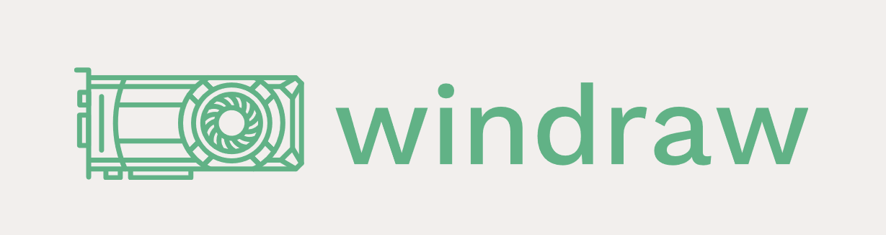

<!---
 Copyright (c) 2018 Kosi Nwabueze
 
 This software is released under the MIT License.
 https://opensource.org/licenses/MIT
-->

</img>

Windraw is a rendering library for Windows that uses Direct2D for simple drawing such as shape rendering and texture rendering.

This library was made originally for the purpose of my visualizer for my [A* algorithm](https://github.com/kosinw/astar); however, this can be extended to be used for any 2D rendering and may be my preferred tool for building 2D emulators and 2D games.

## Authors
- Kosi Nwabueze -- main developer (https://github.com/kosinw/)

## Extending

Future versions may include more sophisticated graphics APIs such as Direct3D or even OpenGL. C# bindings are definitely going to be implemented.

## Building

Windraw uses CMake to generate build files for the MinGW toolchain or the Visual C++ toolchain.

You must use a minimum of CMake version 3.0.1 to compile this library.

CMake outputs a static library; therefore, all you have to do is link the static library to your project and include the headers files in the include directory.

If you are using CMake for your project all you need to do is `include_subdirectories(path/to/windraw)` and use `target_link_library()`.

Preferrably, the Visual Studio 13+ and MSYS Makefiles generators should be used, but others might work.

An example building the static library with debug output for msys + MinGW:
```bash
$ cd path/to/windraw
$ mkdir build
$ cd build
$ cmake -G "MSYS Makefiles" -DCMAKE_BUILD_TYPE="Debug" ..
$ make
```

An example building the static library with vcvarsall setup and Ninja with debug output for VC++
```bash
$ cd path/to/windraw
$ mkdir build
$ cd build
$ cmake -G "Ninja" -DCMAKE_BUILD_TYPE="Debug"
$ ninja
```

<!-- ## Documentation -->

<!-- TODO: implement Doxygen to generate build files -->

## Inspirations
- SFML, I wanted to create a library that uses idiomatic C++ like SFML; yet wasn't so complicated and didn't require so many lines of source code. I also liked the event pump system in SFML.
- XNA, Similar to the reasons of SFML such as the event pump and simplicity.

## License

windraw is covered by the MIT license:
```

Permission is hereby granted, free of charge, to any person obtaining a copy
of this software and associated documentation files (the "Software"), to deal
in the Software without restriction, including without limitation the rights
to use, copy, modify, merge, publish, distribute, sublicense, and/or sell
copies of the Software, and to permit persons to whom the Software is
furnished to do so, subject to the following conditions:

The above copyright notice and this permission notice shall be included in all
copies or substantial portions of the Software.

THE SOFTWARE IS PROVIDED "AS IS", WITHOUT WARRANTY OF ANY KIND, EXPRESS OR
IMPLIED, INCLUDING BUT NOT LIMITED TO THE WARRANTIES OF MERCHANTABILITY,
FITNESS FOR A PARTICULAR PURPOSE AND NONINFRINGEMENT. IN NO EVENT SHALL THE
AUTHORS OR COPYRIGHT HOLDERS BE LIABLE FOR ANY CLAIM, DAMAGES OR OTHER
LIABILITY, WHETHER IN AN ACTION OF CONTRACT, TORT OR OTHERWISE, ARISING FROM,
OUT OF OR IN CONNECTION WITH THE SOFTWARE OR THE USE OR OTHER DEALINGS IN THE
SOFTWARE.
```